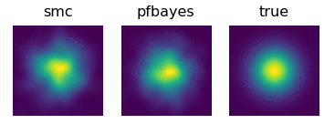

# pfbayes

Implementation of [Particle Flow Bayes’ Rule](http://proceedings.mlr.press/v97/chen19c.html)

Stepwise posterior estimation for 'two-gaussian'.

From left to right: 
1. smc (Sequential Monte Carlo), 
2. pfbayes (our method), 
3. True posterior




# Setup

## Install the package

This package requires the dependency of torch==1.0.0 and torchdiffeq.

```
pip install torch==1.0.0
git clone https://github.com/rtqichen/torchdiffeq
cd torchdiffeq
pip install -e .
```

After that, clone and install the current package.

```
pip install -e .
```

## project structure

The project has the following folder structure:
```
pfbayes
|___pfbayes  # source code
|   |___common # common implementations
|   |___experiments # code for each experiment
|
|___results  # trained model dumps and result statistics
    |___hmm_lds # for hmm lds
    |......
...
```


# Reproducing the experiments

In general, the scripts come with the experiment have the default configurations. 
You can also tune the hyperparameters like number of particles, solver types, etc. 

## Gaussian Mixture Model
The data is generated on the fly. This experiment is mainly used for qualitative evaluation. 

### train/evaluate
First navigate to the experiment folder, and you can use
the pretrained model directly:
```
cd pfbayes/experiments/two_gaussian
./run_main.sh
```
This will generate videos under current `scratch/` folder. You can also try different seeds to see how our pfbayes can estimate the posterior for new sequences. 
To train from scratch, simply set `phase=train` in above script. 


## HMM-LDS

### data
We've included the LDS model and sampled traces under `pfbayes/experiments/hmm_lds/data`. 

You can also create new data and samples using the scripts under that folder, e.g.
```
cd pfbayes/experiments/hmm_lds/data
python saved_lds.py  # this will create a new LDS model
./run_create_test_data.sh  # this will load the model and generate samples
```

### train/evaluate
First navigate to the experiment folder, and you can use
the pretrained model directly:

```
cd pfbayes/experiments/hmm_lds
./run_main.sh
```

This will generate results under current `scratch/` folder

To train from scratch, simply set `phase=train` in above script. 


